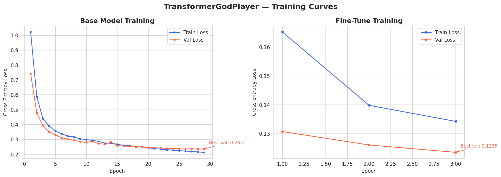
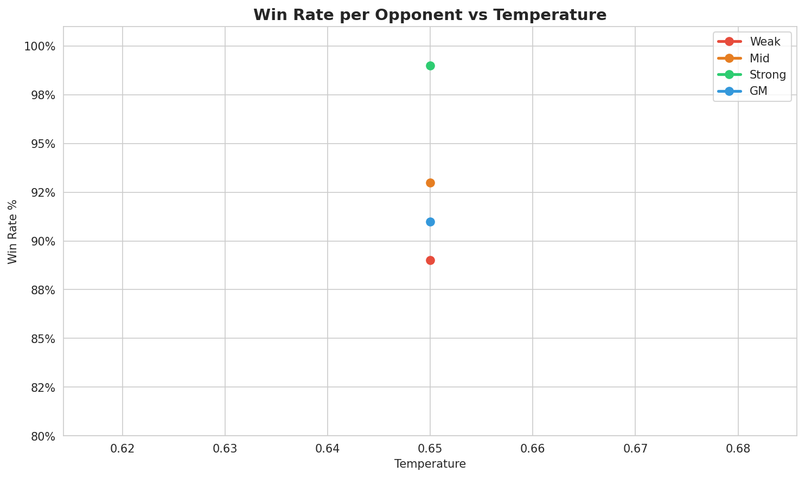

# Chess-God-Transformer
This model is a custom-built Encoder-Decoder Transformer designed to predict the optimal next move in a chess game given a Board State in FEN (Forsyth-Edwards Notation).

## Context
This project was developed for my transformer class. I decided to challenge myself, rather than training an existing model I built it from scratch. **terrible decision**...but here we are.

## Data
I merged data from multiple sources, while paing attention to the limitation of my hardware and the needs of my AI.
1.  **Stockfish-GM Seed:** ~13,000 high-accuracy moves generated by Stockfish 16 at Grandmaster and Strong level. Used In both Fine tuning and Training.
2.  **Human Context:** Integrated 30,000 moves from `bonna46/Chess-FEN-and-NL-Format`. Used In both Fine tuning and Training.
3.  **Tactics:** ~2,500,000+ positions from the `ssingh22/chess-evaluations` (tactics subset). The data were split in two parts: 
    - Fundations (~2mln): Plays that had an evaluation lower than 2000 - used during base model training
    - High Level (~400k): Above 2000 evaluation plays i.e. checkmates or plays that substantial advantage - Fine tuning
4.  **Puzzles:** for fine tuning the closing of the AI I took ~5,500,000+ puzzles with solution from the `lichess/chess-puzzles`. The challenge with these data was to unpack the moves, once done it the whole dataset size increased exponentially. Given the size of the dataset, in `lychess_puzzles.py`, I filter for themes I thought my AI lacked, moreover I took only the most highest rated and played moves. Ultimately I sampled for ~400000+ and got  ~860801 data points. 

## Technical Architecture
The core architecture is based on the original "Attention is All You Need" paper, specifically following the implementation guide from [DataCamp's Transformer Tutorial](https://www.datacamp.com/tutorial/building-a-transformer-with-py-torch).

**ATTEMPT: Hyperparameters** 
Initially I used Optuna for fine tuning the hyperparameters. I run 70 trials with 15 epochs each. We sampled 10% the training data, and used 80% for training and 20% for validation. The search algorithm, it is in similar fashion another [project](https://github.com/LeonSavi/ADS-DW3) I did, and it focused on minimizing two factors:
1. CrossEntropyLoss
2. CrossEntropyLoss Gap between Training Set and Validation Set. This a way to minimize overfitting.

**NOTE**: due to vram limitation of my GPU (rtx4060 laptop - 8gb) I manually set hyperparameters and made ad-hoc changes to the architecture.

```yml
d_model: 256      
num_heads: 8      
num_layers: 6     
d_ff: 1024         
dropout: 0.1      
lr: 0.0003        
batch_size: 64
```

## Training & Optimizations
Given VRAM issues I tweaked the training and the architecture of the model as follow: 
- Mixed Precision Training: Training uses torch.amp.autocast with GradScaler to perform forward passes in float16 while keeping optimizer states in float32. This roughly halves VRAM usage and speeds up training. The attention mask was adjusted from -1e9 to -1e4 to prevent float16 overflow during masked attention computation.
- Gradient Clipping: torch.nn.utils.clip_grad_norm_(model.parameters(), max_norm=1.0) is applied after every backward pass to prevent exploding gradients, which is especially important when combined with Mixed Precision Training.
- Gradient Accumulation: During fine-tuning, gradients are accumulated over 4 steps before each optimizer update, giving an effective batch size of 512 (batch_size=64x acc_steps=4) without requiring additional VRAM.
- Cosine Annealing LR Scheduler: The learning rate decays from the initial value down to eta_min=0.00005 following a cosine curve over the full training run, allowing the model to make large updates early and smaller adjustments later.
- Early Stopping: Training monitors validation loss with a patience of 3 epochs and a minimum improvement delta of 0.002. The best checkpoint is saved automatically, ensuring the final model reflects peak generalization rather than the last epoch.
- Encoder layers 0–2 and decoder layers 0–2 were frozen during fine-tuning to preserve learned general chess representations



### Data 

- Base training: ~2.3M positions combining the ssingh22/chess-evaluations tactics dataset and bonna46/Chess-FEN-and-NL-Format-30K-Dataset
- Fine-tuning: ~1.2mln positions combining checkmate positions (eval ≥ 2000), high-quality Lichess puzzles filtered by popularity ≥ 90, NbPlays ≥ 3000, and rating 300–2200, plus a ~15% general data buffer to prevent forgetting (all data from bonna46 and self generated data)

### Notes
The default Temperature after running 100 matches vs every stockfish-model. Codes are in `tester.py`.


the model **TransformerGodPlayer.pth** is saved in model folder and uploaded in HuggingFace along with **opt-configs.yml**. 

# Requirements
Libraries used are described in `requirements.txt`. If you want to install them in bulk you can run the following command once cd into the directory:
```bash 
pip install -r requirements.txt
```

## How to Use
The model automatically imports a ad-hoc `ChessTokenizer` and the `Transformer` class to load the `.pth` weights, first attemps to load those locally (since the GitHub repo is going to be cloned), otherwise import from HuggingFace.

```python
from player import TransformerPlayer

model = TransformerPlayer() #everything is already initialized

fen = "rnbqkbnr/pppppppp/8/8/8/8/PPPPPPPP/RNBQKBNR w KQkq - 0 1"
move = model.get_move(fen) 
print(f"God-Transformer predicts: {move}")
```


**Fallback**
As a probabilistic model, the Transformer occasionally predicts illegal moves. particularly in unusual positions that differ from the training distribution. A python-chess validation layer is applied inside get_move() to catch these cases before they reach the game engine. The fallback strategy works in three stages:

1. Retry with temperature warmup — if the predicted move is illegal, the model retries up to 4 times with a slightly increasing temperature (+0.05 per attempt). Higher temperature diversifies the probability distribution, often producing a legal move on the second or third attempt. This resolves the majority of cases.
2. Legal move scoring — if all retries fail, rather than playing randomly, every legal move in the position is scored by feeding it token-by-token through the model and summing the log probabilities of each character. The move with the highest cumulative log probability is selected. In this way I make sure the the model's knowledge is still being used.
3. Random fallback — only if both methods above fail (never happened), a random legal move is played.

## References
- Model Architecture: https://www.datacamp.com/tutorial/building-a-transformer-with-py-torch
- Gradient Accumulation: https://medium.com/biased-algorithms/gradient-accumulation-in-pytorch-36962825fa44
- Mixed Precision: https://apxml.com/courses/foundations-transformers-architecture/chapter-7-implementation-details-optimization/mixed-precision-training
- Freezing Layers: https://medium.com/we-talk-data/guide-to-freezing-layers-in-pytorch-best-practices-and-practical-examples-8e644e7a9598
- Gradient Clipping: https://www.geeksforgeeks.org/deep-learning/understanding-gradient-clipping/

